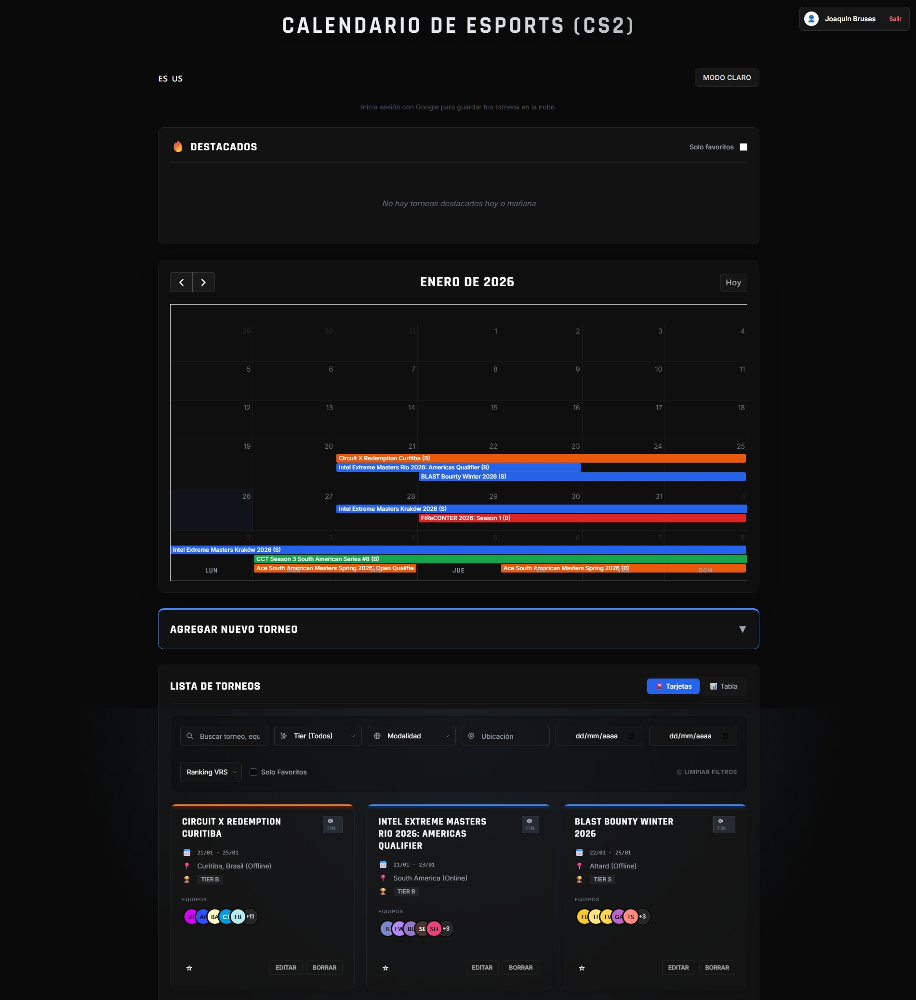
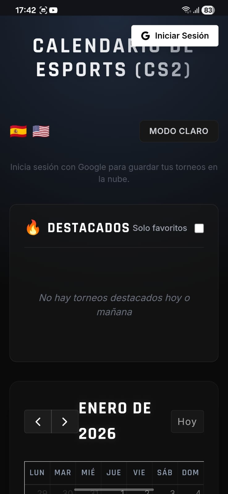

# Esports Tournament Calendar (CS2)

[](https://github.com/jbruses/Tournaments-Calendar-CS2/stargazers)
[](./LICENSE)
[](https://esports-calendar.vercel.app/)
[](https://tailwindcss.com/)
[](https://firebase.google.com/)

A modern, cloud-synced **Progressive Web App (PWA)** to organize Counter-Strike 2 tournaments.  
Built with a modular JavaScript architecture and Glassmorphism design. It supports Google Login for cloud saves, real-time filtering, and works offline.

**[Live Demo on Vercel](https://tournaments-calendar-cs-2.vercel.app/)**

## Screenshots

| Desktop View | Mobile / PWA View |
|:---:|:---:|
|  |  |

---

## Key Features

### Core Functionality
- **Cloud Sync**: Sign in with **Google** (Firebase Auth) to save your tournaments across devices.
- **PWA Ready**: Installable on Android, iOS, and Desktop. Works like a native app.
- **Smart Management**: Create, edit, and delete tournaments with validation.
- **Team Autocomplete**: Suggests pro teams (NaVi, Vitality, G2...) as you type.

###  UI/UX
- **Glassmorphism Design**: Modern UI with backdrop filters and smooth animations.
- **Dark/Light Mode**: Fully themable interface.
- **Bilingual**: Instant switch between **English 🇺🇸** and **Spanish 🇪🇸**.
- **Advanced Filtering**: Filter by Tier (S/A/B/C), Modality (LAN/Online), or specific dates.

###  Utilities
- **View Modes**: Toggle between **Cards** (Visual) and **Table** (Data-dense).
- **Export Options**: Export to `.ics` (Google Calendar/Outlook) or backup via JSON.
- **Sorting**: Sort tables by Date or VRS Ranking relevance.

---

##  Tech Stack

This project uses a **Vanilla JS Modular Architecture**, ensuring high performance and clean code structure.

- **Frontend**: HTML5, Tailwind CSS (via CDN for dev speed), Vanilla JS (ES Modules).
- **Backend / BaaS**: Firebase Authentication (Google Provider) & Firestore Database.
- **Libraries**: FullCalendar (v6).
- **Architecture**: Separated logic (`ui.js`, `tournaments.js`, `utils.js`, `main.js`).

---

## Local Installation

Since this project uses **ES Modules** (`import`/`export`), you cannot simply open the HTML file. You need a local server.

1. **Clone the repository:**
   ```bash
   git clone [https://github.com/jbruses/Tournaments-Calendar-CS2.git](https://github.com/jbruses/Tournaments-Calendar-CS2.git)
   cd Tournaments-Calendar-CS2
   ```
   
2. **Setup Firebase:**
   - Create a project in [Firebase Console](https://console.firebase.google.com/).
   - Enable **Authentication** (Google Provider) and **Firestore**.
   - Create a `js/firebase-config.js` file with your keys (or use the existing one if public rules are set).

3. **Run locally:**
   - If using **VS Code**: Install the "Live Server" extension, right-click `index.html`, and choose "Open with Live Server".
   - Or using Python:
     ```bash
     python3 -m http.server
     ```

4. **Open in Browser:**
   Visit `http://127.0.0.1:5500` (or the port shown).

---

## Roadmap

- [x] Migrate to Modular JS.
- [x] Add Firebase Cloud Sync.
- [x] Implement PWA.
- [ ] Add public tournament sharing links.
- [ ] Add "Pro Circuit" premade calendars (import official Major dates).

---

## Contributions

Contributions are welcome!
1. Fork this repo.
2. Create a branch: `git checkout -b feature/amazing-feature`.
3. Commit your changes.
4. Open a Pull Request.

---

## Contact

- **Email**: [joacobruses@gmail.com](mailto:joacobruses@gmail.com)
- **X (Twitter)**: [@jbruses_](https://x.com/jbruses_)

---

## 📜 License

This project is licensed under the [MIT License](LICENSE).
